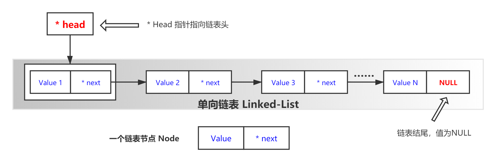
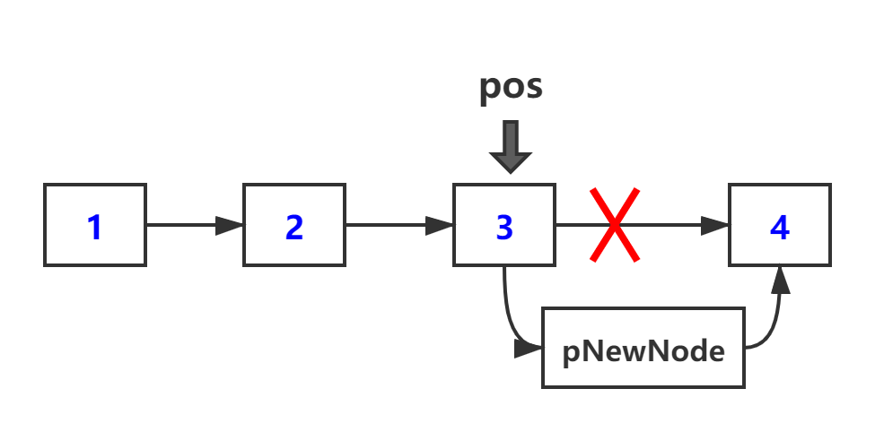
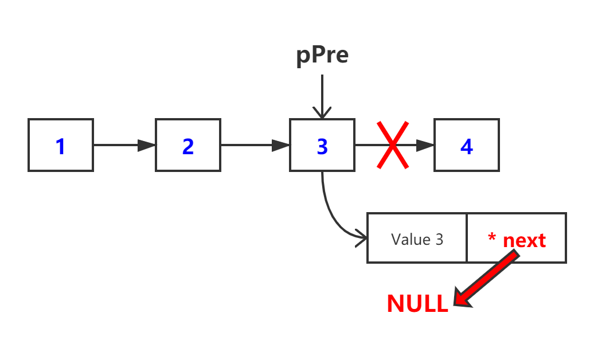
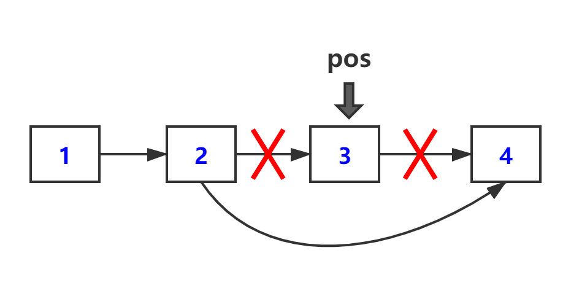

# 单向链表

## 何为单向链表

链表是一种数据结构，你可以把它想象成一种动态的数组，此数组大小不固定，可以在需要时动态增加、删除元素。它解决了使用数组时大小固定不可更改的痛点。



如上图所示，单向链表主要由一个一个节点组成。每个节点包含一个值 `Value` 和一个指针 `* next` ，值 `Value` 用于存储链表中的数值，指针 `* next` 用于指向下一个节点。

定义一个指针 `* Head` 用于指向链表头节点。

头节点的作用：表示单向链表的头部（不存放具体数据）。

设定最后一个节点的 `* next` 的地址为 `NULL` ，表示链表末尾。

## 链表节点

使用结构体定义链表节点:

```c
typedef struct _node
{
	DataType value;		//DataType代表实际中的值类型，例如可以 typedef int DataType
	struct _node *next; //链接到下一个节点
} Node;
```

随后，将整个链表做一封装：

```c
typedef struct _list {
	Node* head;	//指向链表第一个节点
} List;			//list可以代表整个链表
```

### 申请一个节点

```c
Node* CreateNode(DataType value) {
    Node* pNode = (Node*)malloc(sizeof(Node));
    pNode->value = value;
    pNode->next = NULL;
    return pNode;
}
```

## 链表初始化

初始化部分，将链表头 *head 设置为 NULL。

```c
void initList(List* pList) {
    assert(pList);	//检验参数合法性
    pList->head = NULL;
}
```

## 增加元素

### 在链表末尾增加元素

尾插，首先我们要创建一个新节点，然后判断链表当前是否有节点，若没有，则直接让第一个节点指向新节点，若有，找到最后一个节点，让他指向新节点。

```c
void add_at_end (List* pList, DataType value) {
    assert(pList);	//检验参数合法性
    Node* pNewNode = CreateNode(value);	//申请新节点存放元素
    Node* last = pList->head;			//last用于标识原链表中的末尾节点
    //判断当前有无非头节点
    if (last) {
        while (last->next) {	//如果last->next不为NULL，说明还不是原链表末尾节点
            last = last->next;	//不是原链表末尾节点，last后移
        }
        last->next = pNewNode;	//找到原链表末尾节点，让其指向已申请的新节点
    } else {	// last为Null，说明只有头节点，直接让头节点指向已申请的新节点
        pList->head = pNewNode;
    }
}
```

### 在指定位置增加元素

在给定pos位置后插入值为value的节点，分两步完成：首先找到pos位置的节点，然后再插入，所以要实现这一个功能需要两个函数来共同完成。



**注意**：应该先连接好新节点，再断开原来的指针指向。

```c
void add_at_pos(Node* pos, DataType value) {
    Node* pNewNode = NULL;
    if(pos == NULL) {
        return;
    }
    pNewNode = CreateNode(value);
    
    pNewNode->next = pos->next;
    pos->next = pNewNode;
}
```

+ 参数 `pos` 可由函数 `FindNode(&list, value)` 给出（见下文）。

## 删除元素

### 在链表末尾删除元素

尾删，首先判断链表中有没有节点，若没有，直接返回，若有一个节点，直接让第一个节点指向NULL，若有多个节点，则需要记录下倒数第二个节点，让它指向NULL。



```c
void del_at_end(List* pList) {
	assert(pList);	//检验参数合法性
	if (pList->head == NULL) {	//链表中没有节点
		return;
    } else if (pList->head->next == NULL) {	//只有一个节点
        free(pList->head);
        pList->head = NULL;
    } else {                     //多个节点
        Node* pCur = pList->head;
        Node* pPre = NULL;
        while (pCur->next) {
            pPre = pCur;
            pCur = pCur->next;
        }
        free(pCur);
        pPre->next = NULL;
    }
}
```

### 在指定位置删除元素



```c
void del_at_pos(List* pList, Node* pos) {
    assert(pList);	//检验参数合法性
    if (pos == NULL || pList->head == NULL) {
        return;
    }
    if (pos == pList->head) {
        pList->head = pos->next;
    } else {
        Node* pPrePos = pList->head;
        while (pPrePos && pPrePos->next != pos) {
            pPrePos = pPrePos->next;
        }
        pPrePos->next = pos->next;
    }
    free(pos);
}
```

### 删除第一个值为value的节点

要分三种情况：链表为空直接返回、要删除的节点为第一个节点、其它位置的节点。

```c
void del(List* pList, DataType value) {
    assert(pList);	//检验参数合法性
    if (pList->head == NULL) {
        return;
    }
    Node* pPre = NULL;
    Node* pCur = pList->head;
    while (pCur) {
        if (pCur->value == value) {
            if (pCur == pList->head) {	//要删除的是第一个位置的节点
                pList->head = pCur->next;
            } else {
                pPre->next = pCur->next;	//其它位置的情况，让前一个节点指向其后一个节点
            }
            free(pCur);
            return;
        } else {
            pPre = pCur;
            pCur = pCur->next;
        }
    }
}
```

## 改变元素的值

更改pos位置节点的value值。

```c
void changevalue(Node* pos, value) {	//此value为更改后的value
    pos->value = value;   
}
```

## 查找元素

根据指定的value值，找到对应的节点。

```c
Node* FindNode(List* pList, DataType value){
    assert(pList);	//检验参数合法性
    Node* pCur = pList->head;
    while (pCur) {
        if (pCur->value == value) {
            return pCur;
        }
        pCur = pCur->next;
    }
    return NULL;
} 
```

## 打印链表

```c
void printList(List *pList)
{
    assert(pList); //检验参数合法性
    Node *pCur = pList->head;
    while (pCur)
    {
        printf("%d--->", pCur->value);
        pCur = pCur->next;
    }
    printf("\n");
}
```

## 清除链表

```c
void destoryList(List *pList)
{
    assert(pList); //检验参数合法性
    if (pList->head = NULL)
    {
        free(pList->head);
        return;
    }
    while (pList->head)
    {
        Node *temp = pList->head->next;
        free(pList->head);
        pList->head = temp;
    }
}
```

---

<p align="center">COPYRIGHT © 2020 <a href="https://www.xxdiandeng.cn">DianDengJun</a>. | All Rights Reserverd.</p>